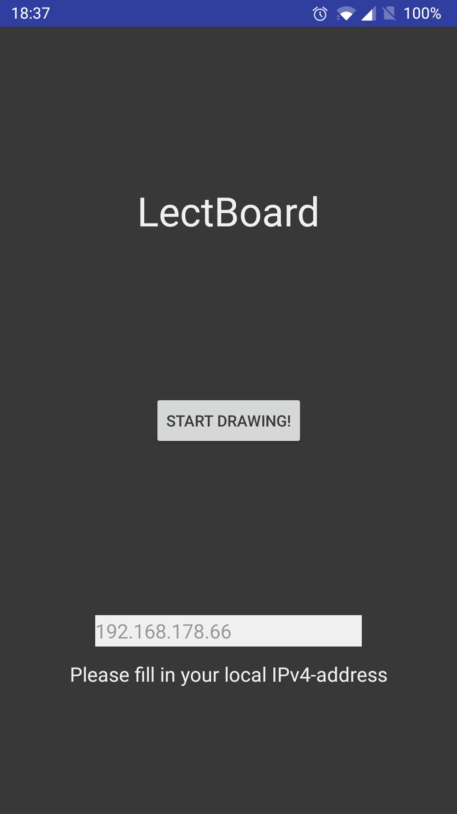
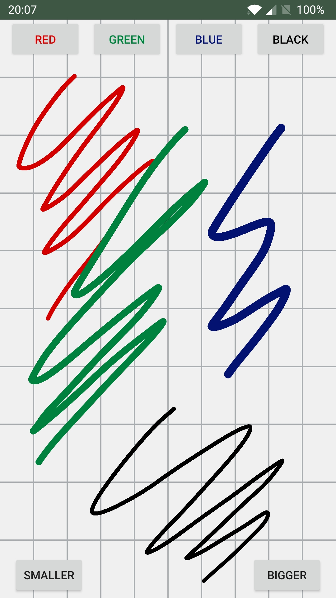

# Lecture Whiteboard App

The android app for running LectBoard on the users device.

## TODO's

* Send paths/difference instead of the whole bitmap
* Rewrite the POST to be non-blocking / coroutine
* Add lines to the background
* Add more colours

## Screenshots

