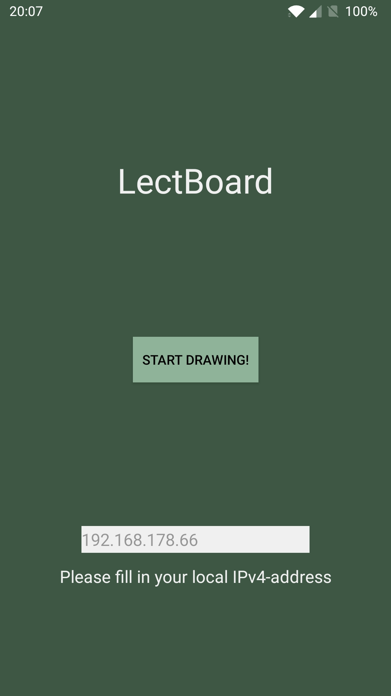

# Lecture Whiteboard App

The android app for running LectBoard on the users device.

## TODO's

* Send paths/difference instead of the whole bitmap
* Rewrite the POST to be non-blocking/coroutine
* Add lines/grid to the background
* Add more colours

## Getting started

* `git clone https://github.com/Denbergvanthijs/lectboard-server`
* `cd lectboard-server`
* `pip install -r requirements.txt`
* `python server.py`
* Open [http://localhost:5000/](http://localhost:5000/) for the front-page of the webserver
* Writedown your local IPv4-address by pressing the _Get local IP-address_ button
* Install the _LectBoard_ app on your android device
* Fill in the local IP-address obtained from your PC
* Start drawing!

## Screenshots

